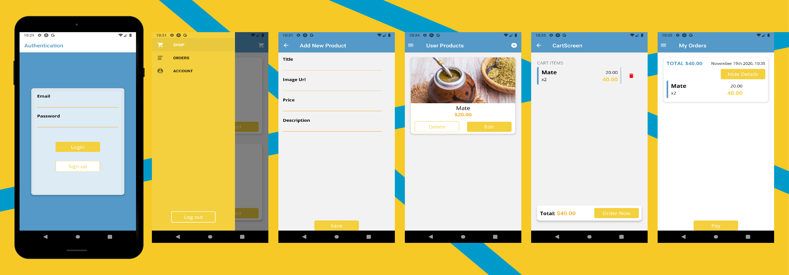

---
---

<h5>Hi stranger, I’m Sebastian!</h5>
<h2>Welcome to this project! 👉 Shopping 👈</h2>

An App made to create and manage products. See other people products, add to your cart and order them!

<h4>You can even play with it! Just follow these  steps to clone the repository</h4>

Whoa, hold on!👮‍♂️ Before you make a move, you need to have git and yarn package manager and Andorid Studio installed on your PC, Xcode in your Mac or Expo App in your mobile device.<em>(You may find the links at the bottom)</em>
<ol>
<li>
<h5><strong>CLONE</strong></h5>

Enter <code>$ git clone https://github.com/Seba-Toso/ReactNative_ShopApp</code> in your <code>command shell </code>and then press ENTER.

</li>
<li>
<h5>GO TO THE PROJECT FOLDER</h5>
<code>cd ReactNative_ShopApp</code>

</li>
<li>
<h5>INSTALL PACKAGES AND LIBRARIES</h5>
<code>yarn install</code>

</li>
<li>
<h5>START IT UP<h5>
<code>expo start</code>

If everything goes rigth, a browser window will be automaticaly oppened and it will show you a QR Code that you can scan with your device and this will open the app.  
If you have Android studio or Xcode, run a virtual device, install expo app on it and run RickAndMorty's App by pressing <code>a</code> for Android Virtual Device or <code>i</code> for Ios Virtual Device, in your command shell

</li>
</ol>

That's it, have fun!

<h2>WOW, I made it!🤯 But, how does this thing WORK</h2>
 
<strong>Prepare your Wallet</strong> 
Sign up or Login with your Email to access the shopping screen. There you will see all available products, enter them to see details and add a certain quantity to your cart. 
When your're up to order, go to Orders Screen by opening the drawer bar with the hamburger button in the upper-left corner.

In this sidebar you can access to main screen, order screen and user screen where you will be able to create or manage you own products.

And that's it.

 
 

<strong>Live long and prosper</strong> 🖖

---
<h5>Git page</h5>
<a href="https://git-scm.com/downloads" title="https://git-scm.com/downloads">git web</a> 
<h5>Yarn package manager</h5>
<code>npm install -g yarn</code>

---
---

 
<strong>Screenshots</strong> 

